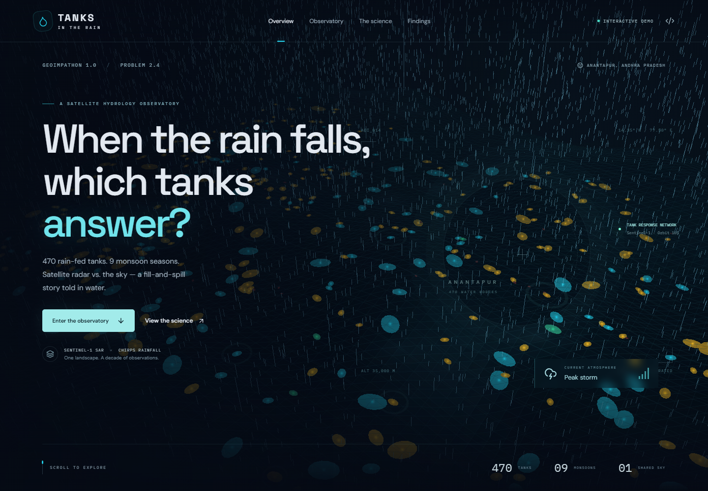
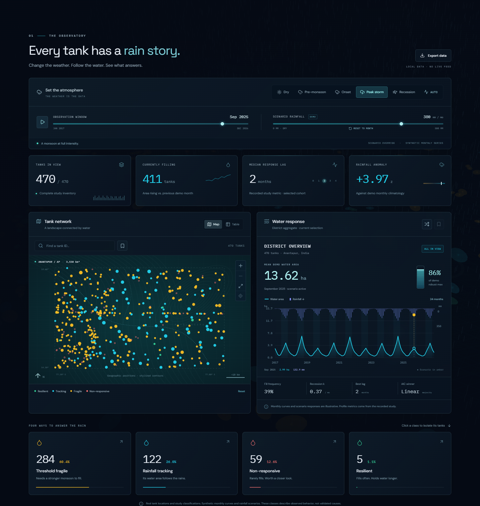
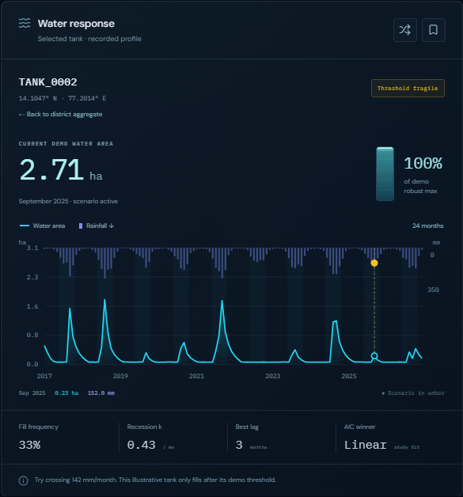
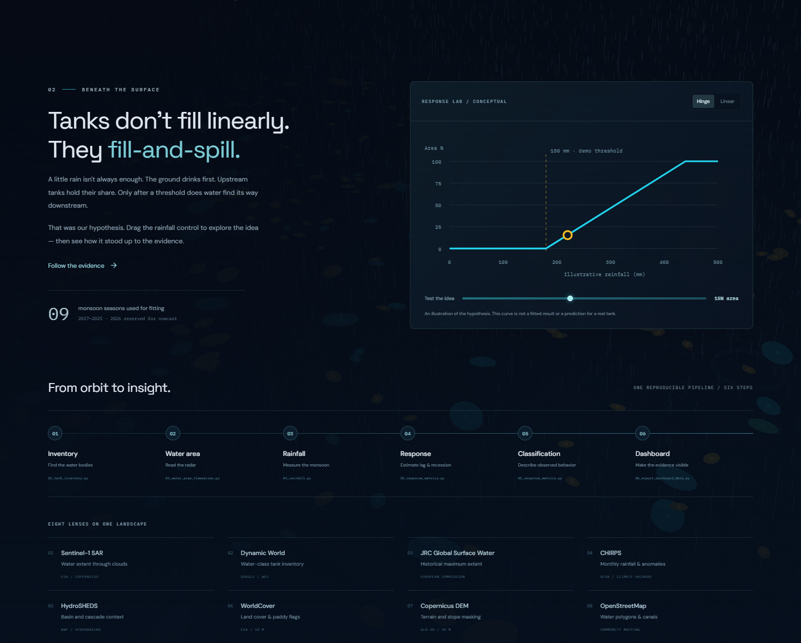
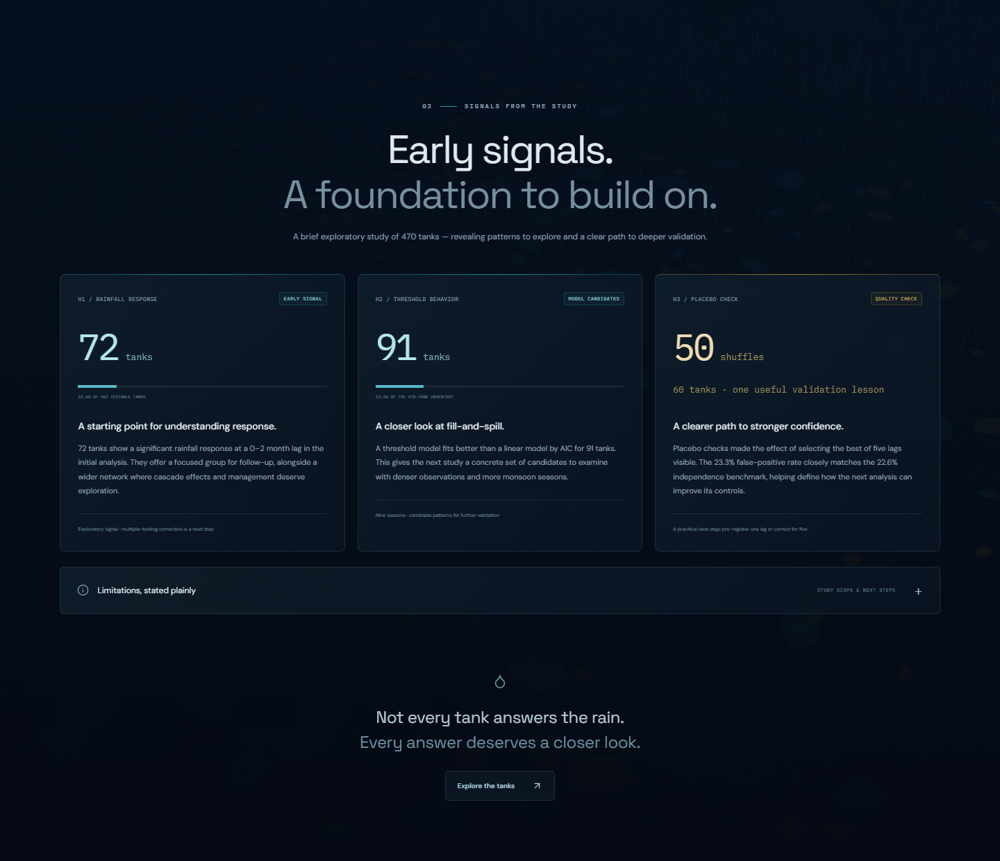
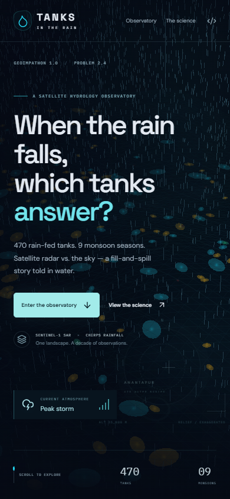
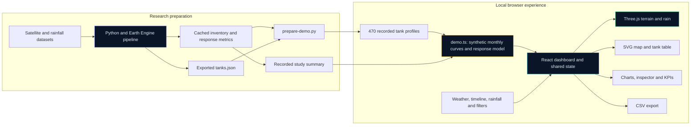
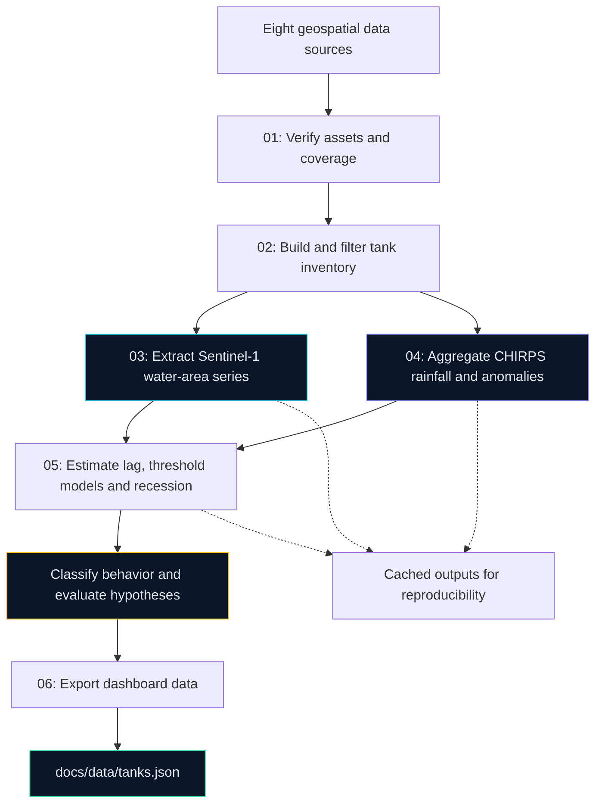
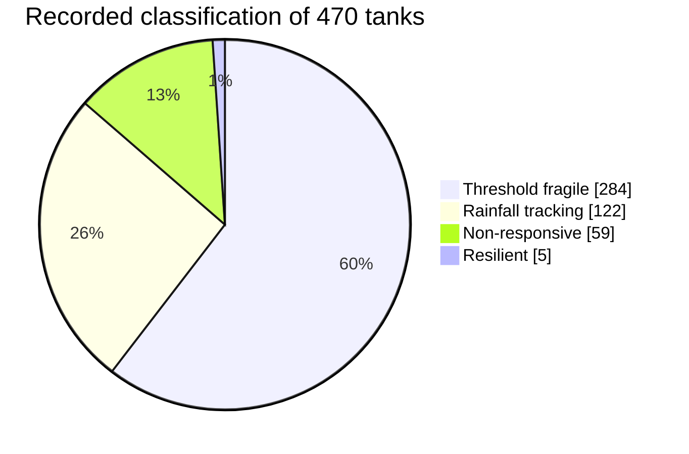

<div align="center">

# 💧 TANKS IN THE RAIN

### When the rain falls, which tanks answer?

**An interactive satellite hydrology observatory for Anantapur, India.**

470 rain-fed irrigation tanks · 9 fitted monsoon seasons · One shared sky

[](https://react.dev/)
[](https://www.typescriptlang.org/)
[](https://threejs.org/)
[](https://vite.dev/)
[](#-run-it-locally)

[**Quick start**](#-run-it-locally) · [**Demo script**](DEMO.md) · [**Screenshots**](#-take-a-look) · [**Architecture**](#-how-it-works) · [**Research notes**](docs/RESEARCH.md)

</div>



## 🌧️ What is this project?

Small irrigation tanks help communities store monsoon water in semi-arid India.
Some hold water through dry months. Others need a stronger monsoon before they
fill. This project brings those different responses into an explorable dashboard.

**Tanks in the Rain** combines a geospatial research pipeline with a static,
interactive website. Change the weather, scrub through seasons, select a tank,
and explore the water response through maps, charts, and a living 3D landscape.

Built for **GEOIMPATHON 1.0 · Problem 2.4**, focused on **Anantapur, Andhra Pradesh**.
The study area spans longitude **77.20–77.80° E**, latitude **14.10–14.60° N**,
and approximately **3,550 km²**.

> **Demo data, clearly labeled:** tank locations, classifications, profile metrics,
> and headline study findings come from recorded research outputs. The monthly
> curves, current rainfall context, and rainfall-slider responses are deterministic
> demonstrations. The website runs from local static assets with no live data API.

## 🚀 Run it locally

You only need **Git and Node.js 22.12+** to run the website. Python and Earth
Engine credentials are required only for reproducing the scientific pipeline.

```sh
git clone https://github.com/DhruvJyotiDas/Rainfall-Surface-Water-Response-Analysis.git
cd Rainfall-Surface-Water-Response-Analysis
npm ci
npm run dev
```

Open **http://127.0.0.1:5173/**. Keep the terminal running while you explore.

<details>
<summary><strong>Present the final production build</strong></summary>

```sh
npm run build
npm run preview -- --port 4173 --strictPort
```

Open **http://127.0.0.1:4173/**. The build is written to `docs/`, alongside
the preserved scientific dataset. If the preview is already running, refresh
the page after rebuilding.

</details>

<details>
<summary><strong>Windows tip</strong></summary>

If PowerShell blocks `npm.ps1`, use `npm.cmd` in place of `npm`:

```powershell
npm.cmd ci
npm.cmd run dev
```

</details>

**Presenting the project?** Follow the [four-minute live-demo script](DEMO.md),
with exact clicks, suggested narration, and answers to common questions.

## 🎛️ Try these interactions first

| Try this | What you will see |
|---|---|
| Switch **Dry → Peak storm** | Rain intensity and simulated water levels respond to the selected context. |
| Select **Threshold fragile**, search `tank_0002`, then drag rainfall **0 → 100 → 400 mm** | The inspector gauge stays low before rising past its illustrative threshold. |
| Select **AUTO**, then scrub or play the timeline | Weather follows the seasonal cycle across the 2017–2026 demo window. |
| Click a map dot or table row | Its class, water-area chart, fill frequency, lag, and recession metric appear in the inspector. |
| Use class chips, search, or bookmarks | The map and aggregate metrics follow your selected cohort. |
| Switch **Map / Table** | Explore geographically or sort and page through the inventory. |
| Click **Export data** | Download a CSV for the visible tanks, including scenario labels. |
| Toggle **Hinge / Linear** in the response lab | Compare the two conceptual filling mechanisms. |

## 📸 Take a look

All screenshots below were captured from the final local production build.

### The observatory

A shared control room for weather, time, rainfall scenarios, tank selection,
and district-level summaries.



<details>
<summary><strong>Tank inspector · science visualizer · findings · mobile</strong></summary>

### Inspect one tank

Recorded profile metrics sit beside an illustrative area/rainfall series.
The amber chart point marks the active rainfall scenario.



### See the mechanism

An interactive hinge/linear chart, the six-step pipeline, and eight data sources.



### Explore early signals

Constructive framing around actual study counts, with study scope and next
steps available in expandable details.



### Use it on a phone

Panels stack on smaller screens. Particle counts are reduced and camera drift
is disabled on mobile/low graphics. Controls remain available.



</details>

## 🏗️ How it works

The project has two connected parts: a reproducible scientific pipeline and
an offline browser experience. The website reads bundled fixtures; it never
calls Earth Engine during a demo.

### Architecture: research outputs → interactive website



**One set of controls drives the experience.** Tank selection, class filters,
the chosen month, and the rainfall override are kept in React state. Derived
values feed the map, inspector, charts, and 3D scene together. Timeline playback
advances the month; AUTO derives its weather state from that month.

### Architecture: the scientific pipeline



The original research pipeline was developed under a one-hour deadline.
Detailed calibration decisions, fixes, study methods, and reproduction commands
are preserved in [the research notes](docs/RESEARCH.md).

## 💧 Four ways to answer the rain



| Class | Tanks | Share | Observed behavior |
|---|---:|---:|---|
| 🟡 Threshold fragile | 284 | 60.4% | Lower fill frequency; a group to investigate under stronger rainfall. |
| 🔵 Rainfall tracking | 122 | 26.0% | Classified as broadly following rainfall. |
| 🔴 Non-responsive | 59 | 12.6% | Rare filling; candidates for closer field investigation. |
| 🟢 Resilient | 5 | 1.1% | High fill frequency and slower recession. |

Percentages are rounded independently. These are descriptive study groupings,
not validated causal categories or operational management recommendations.

### Early signals and useful next steps

| Study result | What it gives the next investigation |
|---|---|
| **72 of 462 testable tanks** show an initial significant rainfall response at 0–2 month lag (**15.6%**) | A focused set of response signals to validate with stronger statistical controls. |
| **91 of 470 tanks** favor a hinge model over a linear fit by AIC (**19.4%**) | Specific threshold-model candidates to investigate with denser observations. |
| **50 validation shuffles** on a **60-tank subsample** | A practical check on lag-selection bias and a direction for improving the next analysis. |

Fitting uses **2017–2025: nine monsoon seasons**. The frontend additionally
includes a **simulated 2026 context**, which is held out of the fitted results.

<a id="limitations-mandatory-honest"></a>
<details>
<summary><strong>Study scope, validation lessons, and next steps</strong></summary>

- H1/H2 did not meet their pre-registered expectations. H1's initial response
  rate was 15.6% against a 50% bar; H2's hinge-winning fraction was 19.4%.
  The highlighted counts are follow-up candidates, not confirmation of the hypotheses.
- The observed placebo false-positive rate was **23.3%**, close to the **22.6%**
  independence benchmark `1 − 0.95⁵` for selecting among five lags. Pre-registering
  one lag or correcting for multiple tests is a clear next step.
- The 470 tanks share **116 CHIRPS pixels**. The initial tests do not correct
  for that pseudo-replication or the five-lag selection.
- Rainfall anomaly is a monthly z-score, rather than a long-baseline fitted SPI.
- Bootstrap confidence intervals, classification sensitivity checks, in-situ
  validation, and external overlap validation remain future work.
- Wind, vegetation, and small tank sizes can affect radar area estimates.
- The frontend's monthly curves, robust maxima, current filling counts,
  scenario responses, and conceptual thresholds are explicitly synthetic.

See [the full research record](docs/RESEARCH.md) and
[frontend data provenance](FRONTEND.md#data-provenance) for details.

</details>

## 🛰️ Data sources

| Source | Role in the study |
|---|---|
| **Sentinel-1 SAR** · Copernicus | Radar-derived water extent; descending relative orbit 165. |
| **Dynamic World** · Google / WRI | Water-class support for the tank inventory. |
| **JRC Global Surface Water** | Historical maximum water extent. |
| **CHIRPS** · UCSB Climate Hazards Center | Monthly rainfall totals and anomalies. |
| **HydroSHEDS / HydroBASINS** · WWF | Basin IDs and cascade context. |
| **ESA WorldCover** | Land-cover and paddy-risk flags. |
| **Copernicus DEM GLO-30** | Terrain and slope masking. |
| **OpenStreetMap** | Water polygons and canal proximity. |

Asset checks and coverage are recorded in
[`cache/asset_verification.json`](cache/asset_verification.json).

## 🧰 Technology

| Layer | Tools used |
|---|---|
| Interface | React 19, TypeScript, Vite 8 |
| 3D atmosphere | Three.js, instanced tank/ripple meshes, GPU shader rain and mist |
| Maps and charts | Custom SVG, with an accessible HTML inventory table |
| Visual system | CSS glass panels, responsive grids, bundled Space Grotesk / DM Sans / IBM Plex Mono fonts |
| Icons | Lucide React |
| Browser verification | Playwright with desktop Chrome and mobile Chromium emulation |
| Scientific pipeline | Python, Google Earth Engine, GeoPandas, NumPy, pandas, SciPy, statsmodels, scikit-learn |

Motion respects OS reduced-motion preferences. Graphics can be paused or
lowered in the footer, and WebGL failure falls back to a CSS atmosphere while
the dashboard remains usable. The full graphics scene uses 14,000 rain streaks;
mobile/low mode uses 3,000. Actual frame rate depends on hardware.

## 🗂️ Find your way around the repository

```text
src/
├── App.tsx                    Dashboard, controls, and page sections
├── components/
│   ├── StormScene.tsx          3D terrain, tanks, rain, mist, and camera
│   ├── TankMap.tsx             Map interactions and inventory table
│   └── Charts.tsx              Time series and conceptual response lab
├── data/
│   ├── demo.ts                Synthetic monthly curves and scenario model
│   ├── tank-seeds.json        470 recorded tank profiles
│   └── study-summary.json     Recorded classification and hypothesis results
└── styles.css                 Responsive visual system

pipeline/                      Scientific extraction and analysis scripts
config/                        Study area, thresholds, and Earth Engine config
cache/                         Cached research outputs
docs/                          Deployable website and scientific dataset
├── data/tanks.json            Original pipeline export
├── images/screenshots/        README gallery
└── RESEARCH.md                Detailed original research notes
scripts/                       Fixture preparation and preview verification
tests/                         Browser checks and pipeline regression tests
```

## ✅ Verification

```sh
npm run build
npm test
```

The website passed **12 desktop/mobile browser checks** covering filters,
search, selection, threshold behavior, table navigation, bookmarks, timeline
playback, CSV exports, charts, responsive layout, reduced motion, offline
interaction, and WebGL context loss. The findings update also passed its
affected desktop/mobile checks and the production smoke test.

Tests use the installed **Chrome** channel and run against the production
preview on port **4173**. If a preview is already running, rebuild first.
For the extra smoke check, keep `npm run preview` running and execute:

```sh
node scripts/verify-production.mjs
```

See [VERIFICATION.md](VERIFICATION.md) for the recorded checks and their limits.

## 📦 Host the website

The compiled website is already committed in **`docs/`**. For GitHub Pages:

1. Open the repository's **Settings → Pages**.
2. Choose **Deploy from a branch**.
3. Select **main** and the **/docs** folder, then save.

You can also serve `docs/` through another static host. Relative asset paths
support hosting beneath the repository path. No website backend or API keys
are needed. Serve over HTTP; opening `index.html` with `file://` is unsupported.

## 📚 Continue exploring

| Guide | Best for |
|---|---|
| [Live demo script](DEMO.md) | A four-minute presentation with exact clicks and narration. |
| [Frontend guide](FRONTEND.md) | Controls, graphics, data provenance, and local development. |
| [Research notes](docs/RESEARCH.md) | Full methods, hypotheses, limitations, and pipeline reproduction. |
| [Verification record](VERIFICATION.md) | What was tested and practical validation limits. |

To refresh the screenshot gallery, keep the production preview running and use
`node scripts/capture-readme.mjs`. To refresh the frontend's recorded fixtures
from existing cached study outputs, use `python scripts/prepare-demo.py`.

---

<div align="center">

**470 tanks. Nine monsoons. One shared sky.**

GEOIMPATHON 1.0 · Problem 2.4 · Anantapur, Andhra Pradesh, India

</div>
