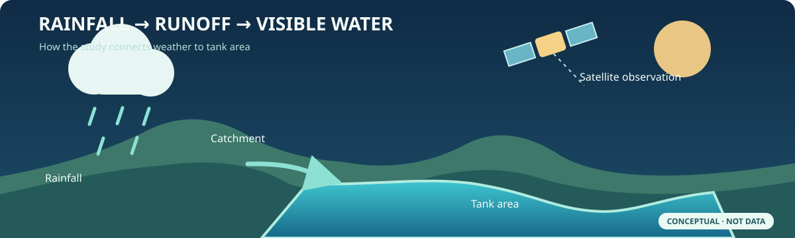
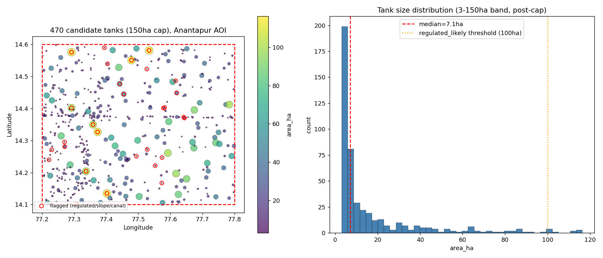
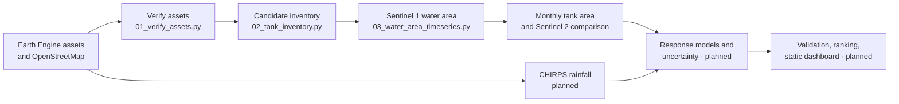

# Rainfall–Surface Water Response Analysis

**GEOIMPATHON 1.0 · Problem 2.4 · Anantapur, Andhra Pradesh**

How do small rain fed irrigation tanks respond to rainfall, and which ones are most vulnerable when a monsoon falls short? This project combines satellite mapped water area, rainfall, and landscape context to estimate tank level response and eventually rank vulnerability with uncertainty.

> **Project status · 30 September 2026:** Earth Engine assets have been verified and a **470 tank candidate inventory** has been built. Sentinel 1 threshold calibration is complete; the time series is being processed and its final outputs are not yet retained in the repository. Rainfall response estimates, vulnerability classes, and the dashboard **have not been produced yet**. The numbers below describe the inventory and processing checks, not measured rainfall effects.



## Study area and current inventory

The confirmed area of interest is a roughly **3,550 km²** window in Anantapur district, Rayalaseema: **77.20–77.80° E, 14.10–14.60° N**. The mapped features are *candidate tanks* based on satellite and OpenStreetMap water polygons; they are not yet a field validated census of functioning rain fed tanks.



*Figure: candidate locations and size distribution from the generated [checkpoint map](cache/checkpoint1_map.png). Color and point size represent mapped area; red rings mark candidates with at least one regulated size, slope, or canal proximity flag. The dashed red box is the study boundary. This is an inventory figure, not a vulnerability map.*

| Verified inventory measure | Value | Evidence |
|:---|---:|:---|
| Candidates after 3–150 ha area and shape filters | **470** | [Inventory statistics](cache/tank_inventory_stats.json) |
| Median mapped candidate area | **7.1 ha** | [Tank polygons](cache/tank_inventory.geojson) |
| Candidates above 100 ha, flagged as likely regulated | **8** | [Inventory statistics](cache/tank_inventory_stats.json) |
| Candidates with mean slope above 10° | **11** | [Inventory statistics](cache/tank_inventory_stats.json) |
| Candidates within 300 m of a mapped canal or drain | **10** | [Inventory statistics](cache/tank_inventory_stats.json) |
| Distinct CHIRPS rainfall pixels serving the 470 candidates | **116** | [Inventory statistics](cache/tank_inventory_stats.json) |
| Tank specific Sentinel 1 thresholds / global fallbacks | **438 / 32** | [Threshold summary](cache/s1_threshold_calibration_summary.json) |

Flags can overlap. Flagged candidates remain in the inventory so they can be inspected; the likely regulated group is intended to be excluded from headline rainfall response statistics.

## Research question

Small tanks can exhibit **fill and spill behavior**: little visible area change during an initial dry period, then rapid expansion once enough rainfall arrives. The planned analysis asks, for each tank:

1. How much seasonal rainfall is associated with filling?
2. How often does it fail to fill in a deficit year?
3. How quickly does visible water recede after the monsoon?
4. Does tank area respond immediately or after a lag?

These are **questions and model targets**, not findings. The preregistered hypotheses are: **H1** at least 50% of tanks respond positively at a 0–2 month lag after deseasonalization and prewhitening; **H2** a hinge model outperforms a linear model by AIC for most tanks; and **H3** shuffled year and negative lag placebo tests show no significant response. None has been tested yet.

## How the pipeline fits together



| Stage | Method and output | Current state |
|:---|:---|:---|
| Asset verification | Check 12 Earth Engine asset IDs and coverage in the study area; save `cache/asset_verification.json`. | **Complete**: all 12 accessible. |
| Candidate inventory | Union JRC `max_extent`, Dynamic World water probability ≥ 0.5, and additional OSM water polygons; vectorize at 30 m; filter by area and elongation in UTM 44N; add basin, land cover, slope, canal and rainfall pixel attributes. | **Complete**: 470 candidates. |
| Radar water area | Smooth Sentinel 1 VV backscatter, set a tank specific Otsu threshold where the histogram is sufficiently bimodal, otherwise use −16 dB; mask slopes ≥ 15°; count water pixels at 20 m. | **In progress**: thresholds complete; final time series output pending. |
| Monthly area and optical comparison | Median area across available images per tank and month with observation count; compare with cloud filtered Sentinel 2 MNDWI water area. | **Implemented in script; durable outputs pending.** |
| Rainfall and response | CHIRPS rainfall, seasonal and lag models, fill frequency, recession, uncertainty, placebo tests. | **Planned; no results.** |
| Validation and presentation | Independent satellite comparisons, vulnerability ranking, static map and dashboard. | **Planned; `docs/index.html` is a placeholder.** |

The existing raster extraction uses **20 m × 20 m per counted pixel** to convert water pixels to hectares. This constant area approximation is an explicit processing choice; it should be checked during validation. Months without Sentinel 1 observations are absent from the monthly table, not interpolated. The planned fitting window is **2017–2025** (June–December seasons); **2026 is reserved for a provisional nowcast**, not hypothesis testing.

## Data and roles

| Source | Role here | State |
|:---|:---|:---|
| JRC Global Surface Water `max_extent` + Dynamic World water probability | Seed candidate water polygons. `max_extent` means ever detected water, **not** an occurrence percentage cutoff. | Used in inventory |
| OpenStreetMap via Overpass | Add water polygons and flag proximity to mapped canals or drains. | Used in inventory |
| HydroSHEDS level 12, ESA WorldCover, Copernicus GLO 30 DEM | Basin grouping, surrounding land cover, and slope quality checks. | Used in inventory |
| Sentinel 1 GRD, VV, relative orbit 165 descending | Repeated radar observations for tank water area. | Extraction in progress |
| Sentinel 2 surface reflectance | Planned optical MNDWI check on radar derived areas. | Asset verified; comparison pending |
| CHIRPS daily rainfall | Planned rainfall totals and anomalies. | Asset verified; rainfall extraction pending |
| JRC monthly water history, 2017–2024 | Planned historical cross check. | Assets verified; validation pending |

The [asset verification file](cache/asset_verification.json) records the exact collection IDs, in area coverage, and check method. Optional ERA5 Land and IMERG collections were also verified, but they have not been analyzed.

## Reproduce the completed work

Use the pinned packages in [`requirements.txt`](requirements.txt), plus `requests` for the OSM inventory step, a Python installation compatible with them, and a Google account authorized to use the registered Earth Engine project in [`config/config.yaml`](config/config.yaml). The current development environment uses Python 3.14. On a new machine, authenticate Earth Engine before running the scripts.

```bash
python -m pip install -r requirements.txt
python -m pip install requests==2.34.2
earthengine authenticate
python pipeline/01_verify_assets.py
python pipeline/02_tank_inventory.py
python pipeline/03_water_area_timeseries.py
python -m pytest -q
```

Run stage 03 when an existing extraction is not already active. Its output is saved by year in `cache/s1_water_area_<year>.csv`; completed years are reused on a rerun. Once the full extraction finishes, the script writes a combined image table, monthly tank area table, and Sentinel 1 versus Sentinel 2 comparison. Scripts initialize Earth Engine even when they reuse cached data. To refresh a particular cached result, remove its specific cache file and rerun the relevant stage; review dependent caches before mixing outputs from different configurations.

| Path | What it contains |
|:---|:---|
| [`config/config.yaml`](config/config.yaml) | Study boundary, date range, filters, model settings, and Earth Engine project. |
| [`pipeline/`](pipeline/) | Asset verification, inventory construction, and radar extraction scripts. |
| [`cache/`](cache/) | Generated GeoJSON, JSON, CSV and checkpoint figures; includes partial outputs. |
| [`tests/test_slope_qc.py`](tests/test_slope_qc.py) | Regression and data checks for a previously discovered DEM slope projection error. |
| [`docs/`](docs/) | GitHub Pages directory; currently a placeholder page. |
| [`CLAUDE.md`](CLAUDE.md) | Detailed build history, decisions, and open work. |

## Interpretation and quality limits

- **Candidate does not mean confirmed tank.** An ever water mask and a maximum water probability can include features that need inspection. Shape and size rules remove obvious non tank features, while regulated size and quality concerns are flagged.
- **Rainfall observations are shared.** The 470 candidates fall into only 116 distinct CHIRPS pixels, so tank observations cannot be treated as independent rainfall samples. The planned uncertainty analysis groups resampling by rainfall pixel.
- **Radar area is imperfect.** Wind roughening, aquatic vegetation, small polygons, and threshold choice can affect water detection. The Sentinel 2 comparison is still pending.
- **No ground gauge validation is available yet.** Satellite to satellite checks can reveal disagreement but do not establish true storage or volume. This project estimates visible surface area, not stored water volume.
- **2026 rainfall is provisional.** The verified CHIRPS collection contained observations through 30 August 2026 when checked; recent months must be marked provisional because of publication lag.
- **Orbit coverage needs context.** The study area has one selected Sentinel 1 relative orbit. Annual image counts were roughly 28–37 during 2017–2025, with a temporary increase in 2019–2020; there was no observed count break specifically after Sentinel 1B ended in December 2021. A separate cadence subsampling run was therefore skipped for this AOI.
- **Slope processing was corrected.** Computing terrain slope on the DEM's degree based native projection initially returned the same value for every candidate. The code now reprojects to UTM 44N first, and the [slope QC test](tests/test_slope_qc.py) checks for a constant series and unflagged outliers.

**Next project checkpoint:** finish the Sentinel 1 time series, monthly aggregation, Sentinel 2 comparison, and visual review of sample tank time series before interpreting rainfall response. The live build record is in [`CLAUDE.md`](CLAUDE.md).
